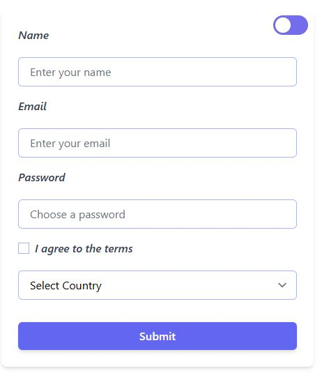

🌙 Tailwind Dark Mode Form (Vite Project)

A simple and responsive form built with Tailwind CSS using Vite as the development environment.It supports Dark Mode, toggled via a custom switch component, with user preference saved using localStorage.

✨ Features

✅ Built with Tailwind CSS

⚡ Powered by Vite — super fast development

🌙 Dark Mode support using class strategy

💾 Persists theme (light/dark) preference in localStorage

🔄 Automatically detects system theme on first visit

📱 Fully responsive and mobile-friendly

🧪 Custom toggle switch with animation using ::before pseudo-element and peer utility

📂 Project Structure

📦 project-root/
┣ 📄 index.html
┣ 📁 src/
┃ ┣ 📄 main.js ← handles theme logic and toggle
┃ ┗ 📄 style.css ← Tailwind directives and custom components
┣ 📄 tailwind.config.js
┣ 📄 package.json

🚀 Setup

npm install
npm run dev

## 📸 Preview

🔗 [Live Demo](https://tailwind-dark-mode-form.vercel.app/)

Note: Make sure to add peer-checked:\* classes to your safelist in Tailwind config to avoid purging animation classes.

🛠️ Customization

You can extend or redesign the form easily with Tailwind's utility classes, or plug in plugins like:

@tailwindcss/forms — for form styling

@tailwindcss/typography — if you want to add blog-style content

📜 License

MIT — feel free to use and modify.

Made with 💙 by Feras

🌙 نموذج Tailwind يدعم الوضع الداكن (مشروع Vite)

نموذج بسيط وسريع الاستجابة مبني باستخدام Tailwind CSS ويعمل على بيئة Vite الحديثة.يدعم الوضع الداكن من خلال زر مخصص، ويتم حفظ تفضيل المستخدم باستخدام localStorage.

✨ المميزات

✅ مبني باستخدام Tailwind CSS

⚡ يعمل بواسطة Vite — تطوير سريع جداً

🌙 دعم للوضع الداكن باستخدام class

💾 يحفظ تفضيل المستخدم للوضع (فاتح/داكن) في localStorage

🔄 يتعرف تلقائياً على وضع النظام عند أول زيارة

📱 متجاوب بشكل كامل مع جميع الأجهزة

🧪 زر تبديل مخصص برسوم متحركة باستخدام ::before و peer

📂 هيكل المشروع

📦 المشروع/
┣ 📄 index.html
┣ 📁 src/
┃ ┣ 📄 main.js ← يتحكم في منطق التبديل بين الثيمات
┃ ┗ 📄 style.css ← تعليمات Tailwind والتخصيصات
┣ 📄 tailwind.config.js
┣ 📄 package.json

🚀 التثبيت والتشغيل

npm install
npm run dev

📸 المعاينة
🔗 [Live Demo](https://tailwind-dark-mode-form.vercel.app/)

ملاحظة: تأكد من إضافة peer-checked:\* إلى safelist في ملف إعدادات Tailwind حتى لا تُحذف أثناء الإنتاج.

🛠️ التخصيص

يمكنك التعديل أو توسيع النموذج بسهولة باستخدام أدوات Tailwind، أو إضافة إضافات مثل:

@tailwindcss/forms — لتنسيق النماذج

@tailwindcss/typography — إذا أردت إضافة محتوى على شكل مدونة

📜 الرخصة

MIT — حر للاستخدام والتعديل.

صنع بحب 💙 بواسطة فراس
